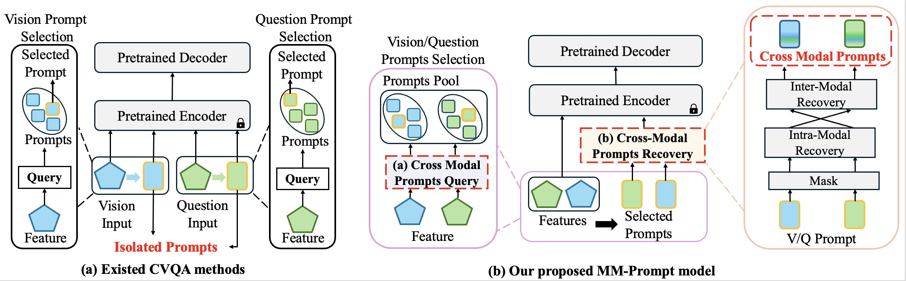
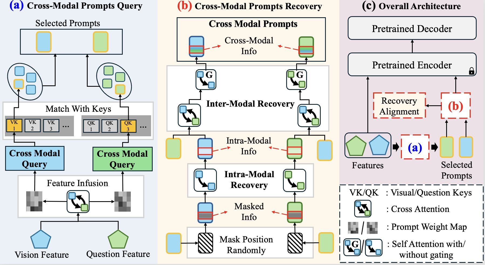
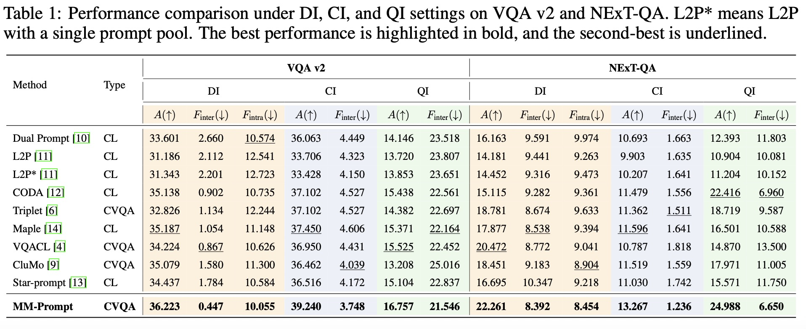

# MM-Prompt: Cross-Modal Prompt Tuning for Continual Visual Question Answering

## Introduction

### 1. Motivation and VQACL Setting
Most prompt-based CVQA methods adopt a cross-modal prompt isolation approach, con
structing and utilizing visual and textual prompts independently without complementary knowledge
understanding. Injecting such modality-isolated prompts amplifies the existing imbalance by providing the model with additional information from its already-preferred modality, diminishing the ability to integrate cross-modal representations. As a result, performance degrades as the model increasingly relies on one modality.



To avoid cross-modal prompt isolation and disrupt the error accumulation of modality imbalance in the two stages, i.e., prompt query and injection, we propose **MM-Prompt**, as shown in Fig. 1. MM-Prompt consists of two key components, including cross-modal prompt query and cross-modal prompt recovery.
First, the **Cross-Modal Prompt Query** module enhances prompt selection by mixing information from the opposite modality into each query prior to retrieval, enabling more balanced and context-aware selection.
Second, the **Cross-Modal Prompt Recovery** module jointly masks and reconstructs prompts through progressively enriched cross-modal interactions, effectively embedding fused information into the prompt space before the injection stage. Alignment losses are applied to prevent representational drift. Together, these components promote balanced modality utilization, enhance accuracy, and reduce forgetting.

### 2. Method


As illustrated in Fig.2, our MM-Prompt model differs fundamentally from existing CVQA approaches by introducing explicit cross-modal interactions at multiple stages. The overall workflow, shown in Fig.~\ref{framework}, consists of two complementary mechanisms that work together to maintain balanced modality representation. First, input features from vision and question modalities undergo Cross-Modal Prompts Query. In this stage, each modality's features attend to the opposite modality before generating query vectors. These enriched queries are then used to select relevant prompts. Then, a mask will be applied on the weighted sum of these selected prompts to create explicit pathways for cross-modal prompts recovery. The masked prompts then first process through intra-modal recovery to establish basic modality-specific patterns while introducing light cross-modal influence, followed by cross-modal that further integrates information across modalities through attention mechanisms and selective enhancement. The result is a set of recovered prompts that maintain balanced representations from both modalities. 

### 3. Experiment
<div align="center"></div>

During experiments, as shown in Table 1, we investigate and evaluate MM-Prompt against 9 outstanding and state-of-the-art methods, including 6 general CL methods and 3 CVQA methods. MM-Prompt consistently outperforms all the other methods across all settings. On VQA v2, it achieves 36.223% in DI (vs. MaPLe's 35.187%), 39.240\% in CI (vs. MaPLe's 37.450%), and 16.757\% in QI (vs. VQACL's 15.525%). Notably, it reduces forgetting to less than half of the next best method in DI. On NExT-QA, MM-Prompt similarly exceed with 22.261\% in DI (vs. VQACL's 20.472%), 13.267\% in CI (vs. MaPLe's 11.596%), and 24.988\% in QI (vs. CODA's 22.416%), all while maintaining lower forgetting rates. While the second-best method varies across different incremental scenarios, MM-Prompt's consistent superiority highlights its robustness across diverse settings.

## Setup
```bash
# Create python environment (optional)
conda create -n vqacl python=3.7
source activate vqacl

# Install python dependencies
pip install -r requirements.txt

# Download T5 backbone checkpoint
python download_backbones.py

```

## Code structure
```bash
# Store images, features, and annotations
./datasets
    COCO/
        dataset_coco.json
        features/
    vqa/
        Paritition_Q/
    nextqa/
        Paritition_Q/
    ...


# Training logic
./MM-Prompt/
    src/
        modeling.py                                           <= main model classes
        cvqa.py vqa_data_memory.py vqa_model.py ...           <= training executor and dataloader
        param.py                                              <= (argparse) configuration
    snap/                                                     <= store weight checkpoints
    scripts/                                                  <= bash scripts
```

## Featurs/ Dataset Preparation
- Download the DI partition of VQA v2 from [Google Drive](https://drive.google.com/drive/folders/1fzcTAhMHbaGeB0lU23ZUu2CRSrULV675?usp=sharing) and put it into datasets/nextqa/Partition_Q.
- Download the DI partition of NExT-QA from [Google Drive](https://drive.google.com/drive/folders/15BYsnqZ2HXH_4-a1tb9feQZ3pkjQAL5p?usp=sharing) and put it into datasets/vqa/Partition_Q.
- Download `datasets/COCO` and put the files under `vqa` in to `datasets/vqa` from [Google Drive](https://drive.google.com/drive/folders/1MBBhlkP83VMKS2Qe0SmFfzkHhMpIG5wf?usp=sharing) (**official link**)
- Download video features of NExT-QA from [Goolge Drive](https://drive.google.com/drive/folders/15BYsnqZ2HXH_4-a1tb9feQZ3pkjQAL5p?usp=sharing)(**official link**) and put it into datatsets/nextqa/


## Execute the file

```bash
# Training VQA v2
cd MM-Prompt/
bash scripts/CVQA_train.sh # Standard Training

# Testing for VQA v2
cd VL-T5/
bash scripts/CVQA.sh  # Standard Testing
```

## Acknowledgement

Part of our job is based on the official [VQACL](https://github.com/zhangxi1997/VQACL) repository, we thank the authors to release their code. If you use the related part, please cite the corresponding paper commented in the code.
